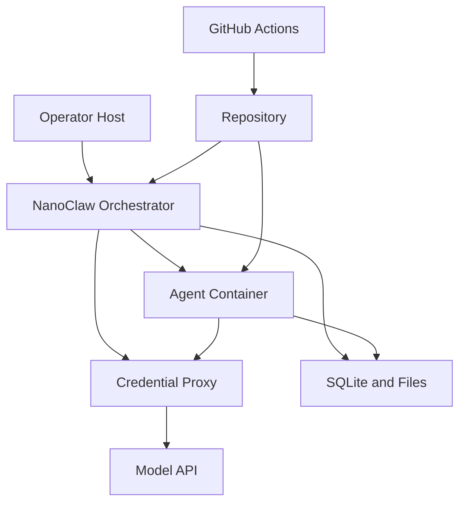

## Executive summary

The core security problem in this repository is not classic web exposure; it is trust-boundary failure between host, containerized agent, and automation. The most important abuse paths are host-state leakage into containers, misuse of the credential proxy, and supply-chain drift in the Docker and GitHub Actions build path. This audit hardened the biggest container and proxy boundaries, but build provenance and write-capable automation remain the main residual risks.

## Scope and assumptions

In scope:
- `src/**`
- `setup/**`
- `container/**`
- `.github/workflows/**`
- `package.json`
- `package-lock.json`

Out of scope:
- Channel integrations added by downstream skills or forks; the base checkout does not ship active channel implementations in `src/channels/index.ts`.
- Host firewall policy, Docker daemon configuration, and GitHub branch-protection settings.

Assumptions:
- Deployment is single-user and self-hosted on a workstation or laptop.
- Containers must be treated as attacker-controlled once prompted.
- Anthropic or Anthropic-compatible credentials are stored locally and must never cross into containers directly.
- GitHub-hosted workflows run on pushes to `main` and may have access to repository write tokens.
- No additional service owner context was provided, so risk is ranked for a typical personal-assistant deployment with internet-connected messaging channels added later.

Open questions that would materially change ranking:
- Are any downstream channel skills internet-exposed without platform-side auth or sender verification?
- Is the project built from a private registry / mirror, or directly from public npm and Docker Hub?
- Are protected branches and required reviews enforced on the canonical repository?

## System model

### Primary components

- Host orchestrator: the Node.js process that loads state, watches IPC, routes messages, and launches agent containers. Evidence: `src/index.ts`, `src/ipc.ts`, `src/group-queue.ts`, `src/task-scheduler.ts`.
- Host persistence: SQLite and filesystem state for messages, sessions, tasks, and group metadata. Evidence: `src/db.ts`, `src/group-folder.ts`.
- Credential proxy: local HTTP proxy that injects host credentials into outbound Anthropic-compatible requests. Evidence: `src/credential-proxy.ts`, `src/container-runtime.ts`.
- Agent container runtime: Docker-based execution boundary for the Claude agent and container-side MCP bridge. Evidence: `src/container-runner.ts`, `container/Dockerfile`, `container/agent-runner/src/index.ts`, `container/agent-runner/src/ipc-mcp-stdio.ts`.
- Setup and operator tooling: CLI steps that build the container, detect environment, and install service-manager entries. Evidence: `setup/index.ts`, `setup/*.ts`.
- CI/build automation: workflows that validate PRs and, on `main`, update artifacts or merge-forward skill branches. Evidence: `.github/workflows/*.yml`.

### Data flows and trust boundaries

- Operator host -> NanoClaw orchestrator
  - Data: `.env` credentials, local filesystem state, group folders, runtime configuration.
  - Channel/protocol: local filesystem and process environment.
  - Security guarantees: local OS permissions only; no network auth boundary.
  - Validation: selective `.env` reads in `src/env.ts`; group-folder validation in `src/group-folder.ts`.

- NanoClaw orchestrator -> credential proxy
  - Data: real Anthropic API key or OAuth token.
  - Channel/protocol: in-process state and local bind address.
  - Security guarantees: proxy host binding and local-only intent.
  - Validation: upstream URL validation and safe bind selection in `src/credential-proxy.ts` and `src/container-runtime.ts`.

- NanoClaw orchestrator -> agent container
  - Data: prompts, per-group writable mounts, IPC paths, placeholder credentials, optional additional mounts.
  - Channel/protocol: Docker bind mounts, stdin, environment variables.
  - Security guarantees: container isolation, curated readonly repo mounts, per-group IPC namespaces, external mount allowlist.
  - Validation: mount selection in `src/container-runner.ts`; allowlist enforcement in `src/mount-security.ts`.

- Agent container -> credential proxy -> upstream model API
  - Data: model prompts, tool traffic, placeholder auth headers, injected host credentials.
  - Channel/protocol: HTTP over host gateway.
  - Security guarantees: auth header replacement, hop-by-hop header stripping, request body and timeout limits.
  - Validation: `src/credential-proxy.ts`.

- Agent container -> host IPC watcher
  - Data: message sends, task creation/updates, group registration requests.
  - Channel/protocol: filesystem IPC under `/workspace/ipc`.
  - Security guarantees: per-group directories, main-group-only operations, folder validation.
  - Validation: `src/ipc.ts`, `src/group-folder.ts`.

- GitHub Actions -> repository
  - Data: source checkout, npm dependencies, generated badge/version commits, branch merges.
  - Channel/protocol: GitHub-hosted runners and repo write tokens.
  - Security guarantees: action pinning and explicit permissions only.
  - Validation: workflow definitions in `.github/workflows/*.yml`.

#### Diagram

## Assets and security objectives

| Asset | Why it matters | Security objective (C/I/A) |
| --- | --- | --- |
| Anthropic credentials and OAuth tokens | Credential theft gives direct API access and billing abuse | C/I |
| Conversation history and task state | Contains private user content and agent state | C/I |
| Group folders and CLAUDE memory | Defines agent behavior and can contain sensitive operator context | C/I |
| Host filesystem mounts | Accidental or malicious exposure breaks sandbox guarantees | C/I |
| Build artifacts and container image contents | Supply-chain compromise changes runtime behavior | I/A |
| GitHub workflow tokens and write privileges | Can mutate the canonical repo and propagate bad commits | I |
| Availability of the orchestrator and proxy | Required for normal message handling and scheduled jobs | A |

## Attacker model

### Capabilities

- Can control prompts reaching an agent container.
- Can operate as a malicious or compromised container workload.
- Can attempt to abuse write-capable GitHub workflows if repo permissions or secrets are compromised.
- Can influence build inputs through public npm or GitHub Action dependencies.

### Non-capabilities

- Cannot directly bypass Docker isolation through this repository alone.
- Cannot directly read host `.env` credentials from the container if the proxy and mount boundaries hold.
- Cannot act through channel integrations that are not present in the checked-out code without an added downstream skill/fork.

## Entry points and attack surfaces

| Surface | How reached | Trust boundary | Notes | Evidence (repo path / symbol) |
| --- | --- | --- | --- | --- |
| Setup CLI | Operator runs `tsx setup/index.ts` | Operator -> host process | Builds images, registers services, writes files | `setup/index.ts`, `setup/service.ts`, `setup/container.ts` |
| Credential proxy | Container HTTP requests via host gateway | Container -> host | Secret injection boundary | `src/credential-proxy.ts`, `src/container-runtime.ts` |
| Container launch path | New message, task, or queue wake-up | Host -> container | Defines mounts, env, and working dirs | `src/container-runner.ts`, `src/index.ts` |
| IPC task/message files | Agent writes files into `/workspace/ipc` | Container -> host | Can request messages, tasks, refresh, group registration | `container/agent-runner/src/ipc-mcp-stdio.ts`, `src/ipc.ts` |
| Remote control command | Main-group chat command | User/main group -> host detached process | Spawns `claude remote-control` and returns URL | `src/index.ts`, `src/remote-control.ts` |
| CI workflows | Pull request or `main` push | GitHub runner -> repository | Build/test and write-back jobs | `.github/workflows/*.yml` |

## Top abuse paths

1. Attacker gains influence over a main-group session -> container reads overly broad host mounts -> exfiltrates SQLite state or runtime files -> user privacy and integrity loss.
2. Malicious container sends oversized or hanging requests -> credential proxy consumes host resources -> orchestrator degradation or outage.
3. Operator or malicious config sets a cleartext remote `ANTHROPIC_BASE_URL` -> proxy forwards real credentials to untrusted upstream -> credential theft.
4. Hostile checkout injects bundled skills or writable runner code -> future sessions inherit malicious prompts/runtime behavior -> persistence across conversations.
5. Compromised npm or GitHub Action dependency lands in build path -> container image or workflow behavior changes -> supply-chain compromise of runtime or repo state.
6. Write-capable workflow token is abused -> bot job pushes bad commits to `main` or skill branches -> trusted downstream forks ingest malicious updates.
7. Overly broad mount allowlist grants additional host roots -> compromised container writes or reads sensitive host files -> sandbox bypass by policy.

## Threat model table

| Threat ID | Threat source | Prerequisites | Threat action | Impact | Impacted assets | Existing controls (evidence) | Gaps | Recommended mitigations | Detection ideas | Likelihood | Impact severity | Priority |
| --- | --- | --- | --- | --- | --- | --- | --- | --- | --- | --- | --- | --- |
| TM-001 | Compromised or prompt-injected container | Container can access main-group repo mounts | Read host runtime state that should not be visible in-container | Privacy loss, sandbox trust failure | Conversation history, runtime state, host files | Curated readonly mount list and symlink rejection in `src/container-runner.ts:59-145` | Additional mounts can still widen exposure by policy | Keep main mounts minimal; review external allowlist regularly | Alert on unexpected additional-mount usage; inspect container logs | Medium | High | high |
| TM-002 | Adversarial container workload | Container can reach host proxy | Flood proxy with large or hanging requests | Host resource exhaustion | Orchestrator availability, API path availability | Body cap and timeouts in `src/credential-proxy.ts:26-189` | Proxy remains a host-side choke point | Add metrics for 413/504/502 counts; optionally rate-limit per container | Monitor proxy error rate and process RSS | Medium | Medium | medium |
| TM-003 | Malicious config or compromised operator env | Ability to set `ANTHROPIC_BASE_URL` | Redirect credential proxy to unsafe upstream | Credential theft | Anthropic credentials, billing | Cleartext remote HTTP blocked by default in `src/credential-proxy.ts:38-74` | HTTPS custom upstreams are still trusted transitively | Use an allowlist of approved upstream domains or an internal proxy | Log non-default upstream hostnames at startup | Medium | High | high |
| TM-004 | Hostile repository content | Repo contents influence runtime image/session | Inject bundled prompts or persistent runtime code | Agent behavior compromise and persistence | Agent integrity, user trust | Bundled skills opt-in and writable `/app/src` overlay removed in `src/container-runner.ts:208-229` | Static repo content can still influence builds and operator decisions | Keep repo reviewable; pin base images and package provenance | Diff-based review of runtime-related files before deploy | Medium | High | high |
| TM-005 | Public dependency or Action compromise | Build or CI fetches mutable upstream refs | Ship compromised image or execute malicious workflow code | Repo and runtime integrity compromise | Source code, image contents, CI trust | Action SHAs pinned in workflows; package override in `package.json:39-40`; Docker npm versions pinned in `container/Dockerfile:4-49` | Base image tag is still floating; global npm installs still rely on public registry integrity | Pin base image digest; move npm installs behind a private registry or checked-in lockfile | Build attestation, SBOM diff, image digest monitoring | Medium | High | high |
| TM-006 | Workflow-token abuse | Access to repo write token or branch automation path | Auto-push bad commits or merge-forward malicious state | Supply-chain propagation to downstream forks | Repository integrity | Explicit workflow permissions and pinned actions in `.github/workflows/*.yml` | Jobs still auto-push on `main` | Require protected branches and manual approval for write jobs | Alert on bot-authored pushes and unexpected workflow dispatches | Low | High | medium |
| TM-007 | Misconfigured mount allowlist | Operator broadens allowed roots | Mount sensitive host directories into container | Host file exposure or modification | Host filesystem, secrets, code | External allowlist and blocked patterns in `src/mount-security.ts` | Security depends on operator policy quality | Treat allowlist as security policy with review and least privilege | Audit allowlist changes; log readonly vs readwrite mounts | Medium | Medium | medium |

## Criticality calibration

Critical for this repo:
- Host credential theft through the proxy.
- Cross-boundary host file exposure that defeats the container isolation claim.
- Supply-chain compromise that can push malicious commits automatically to trusted branches.

High for this repo:
- Main-group host-state leakage via mounts.
- Build-time compromise through mutable base images or package sources.
- Repo-bundled prompt/runtime persistence into future agent sessions.

Medium for this repo:
- Container-triggered DoS against the proxy or orchestrator.
- Over-broad additional mount policy controlled by the operator.
- Workflow misuse requiring prior repo or secret compromise.

Low for this repo:
- Information leaks limited to static repo files already intended for inspection.
- Noisy CI failures without write impact.
- Local-only setup inconveniences that do not cross a trust boundary.

## Focus paths for security review

| Path | Why it matters | Related Threat IDs |
| --- | --- | --- |
| `src/container-runner.ts` | Defines the container/host mount and session boundary | TM-001, TM-004, TM-007 |
| `src/credential-proxy.ts` | Sole host component that injects live credentials | TM-002, TM-003 |
| `src/container-runtime.ts` | Determines safe proxy binding and host gateway behavior | TM-002, TM-003 |
| `src/ipc.ts` | Authorizes container-originated task and message requests | TM-001, TM-007 |
| `src/mount-security.ts` | Governs operator-controlled escape hatches into the host filesystem | TM-007 |
| `container/Dockerfile` | Controls package and base-image supply-chain exposure | TM-004, TM-005 |
| `.github/workflows/merge-forward-skills.yml` | Highest-impact write-capable workflow path | TM-005, TM-006 |
| `.github/workflows/update-tokens.yml` | Auto-commit path on `main` | TM-005, TM-006 |
| `.github/workflows/bump-version.yml` | Auto-commit path on `main` | TM-005, TM-006 |
| `setup/service.ts` | Writes persistent service-manager entries and launches privileged host behavior | TM-001 |
| `setup/container.ts` | Builds and test-runs the runtime image from host tooling | TM-005 |
| `container/agent-runner/src/ipc-mcp-stdio.ts` | Container-side API exposed to the agent runtime | TM-001, TM-004 |

## Quality check

- All discovered entry points are covered.
- Each major trust boundary appears in at least one threat.
- Runtime behavior is separated from CI/build tooling.
- No user clarification was available; assumptions are explicit above.
- Residual build-provenance and automation risks are called out separately from the fixed code issues.

This threat model was written to `/Users/j.csandoval/ms-nano-claw/ms-nano-claw-threat-model.md`.
